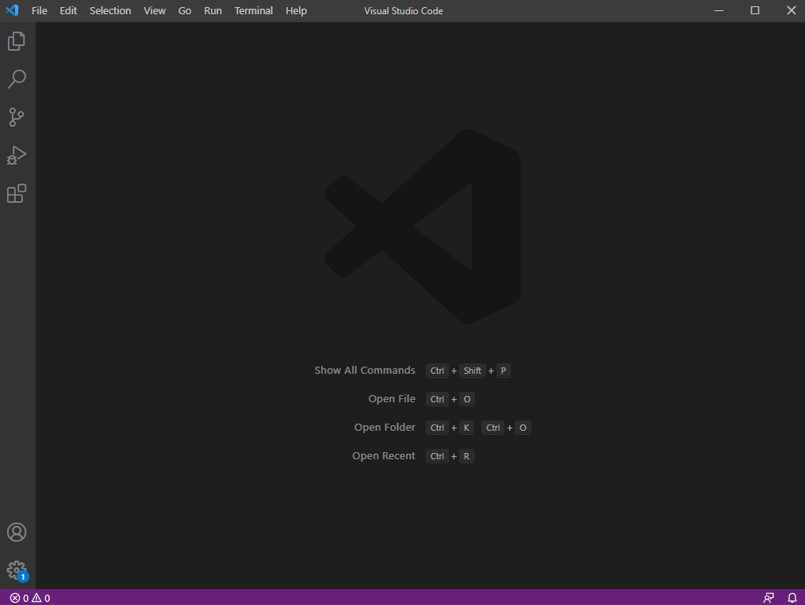
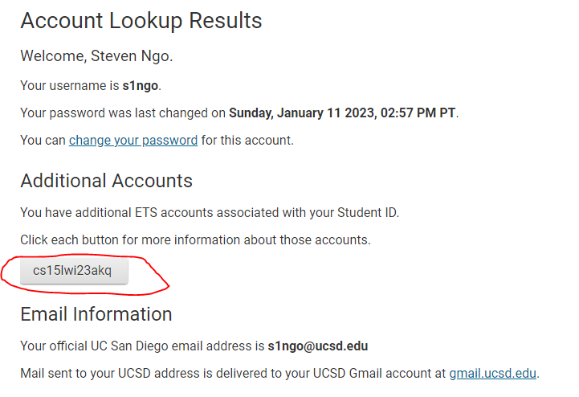
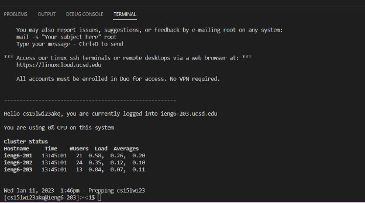
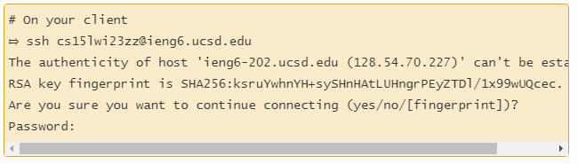
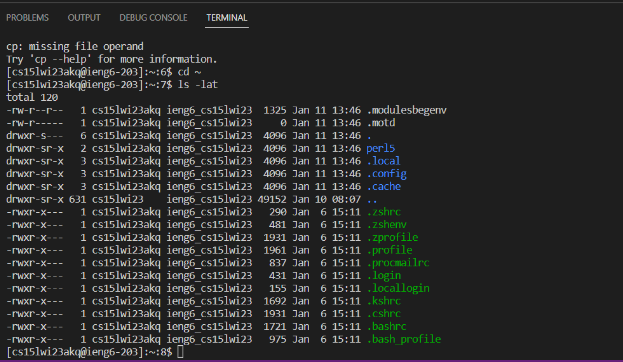

## Installing VScode
* To install, go to their [website](http://code.visualstudio.com) and from there you will be able to download VScode.
* Below is what VScode would look like when opened up:

## Remotely Connecting
* To connect to a remote computer, first step is to install [git](https://gitforwindows.org/) if on Windows and set the VScode's default terminal to git bash.
* To find your 15L course account, go to [this website](https://sdacs.ucsd.edu/~icc/index.php). If you want to reset your password, go to [this website](https://password.ucsd.edu/) and follow the next instructions located there. Going back to finding your course account, enter your username and student ID on the website. Below is what your page would like after logging in to find your account:

* To use ssh, open up the VScode terminal and the command should look like this `$ ssh cs15lwi23zz@ieng6.ucsd.edu` (zz is replaced by letters in your course-specific account)
* When connected, your terminal should look like this:
 
 
* Note: Users may see an authentication message and they will have to type yes and enter their password. Below is what your terminal would look like with the authentication message (picture is from [week 1 lab write-up](https://ucsd-cse15l-w23.github.io/week/week1/)):

## Trying Some Commands
 * You can run commands in the terminal such as `cd`, `ls`, `pwd`, etc. 
 * Below is what the terminal would look like when running commands:
 
 * Running the command `ls -lat` will list the files in the current directory.

