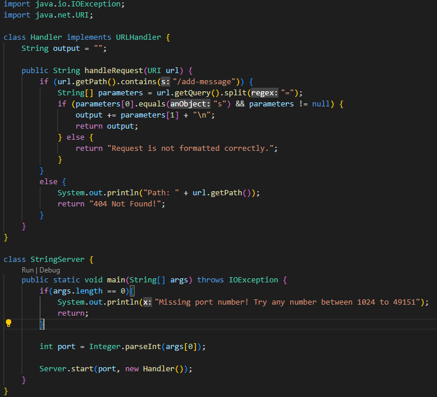
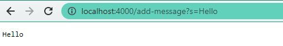
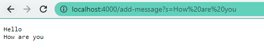
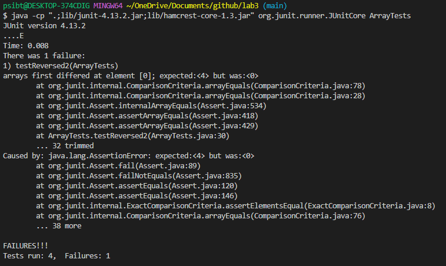
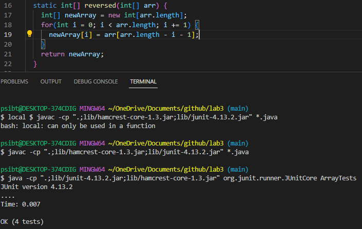

# Lab Report Week 3
## Part 1
StringServer web server started with lab 2's NumberServer code as reference.

* Compiled using `javac Server.java StringServer.java` and ran using `java StringServer 4000`, going to `http://localhost:4000/add-message?s=Hello` will lead to:



and going to `http://localhost:4000/add-message?s=How%20are%20you` will lead to:


* For both of the screenshots, the handleRequest method was used. If the string `/add-message` was included in the link, the web server will display the value in the output string variable after the `=`. in the link.

## Part 2 
* JUnit test that failed (testReversed2):
```
@Test 
	public void testReverseInPlace() {
    int[] input1 = { 3 };
    ArrayExamples.reverseInPlace(input1);
    assertArrayEquals(new int[]{ 3 }, input1);
	}


  @Test
  public void testReversed() {
    int[] input1 = { };
    assertArrayEquals(new int[]{ }, ArrayExamples.reversed(input1));
  }
  
	@Test 
	public void testReverseInPlace2() {
    int[] input1 = {1, 2, 3};
    ArrayExamples.reverseInPlace(input1);
    assertArrayEquals(new int[]{3, 2, 1}, input1);
	}


  @Test
  public void testReversed2() {
    int[] input1 = {1, 2, 3, 4};
    assertArrayEquals(new int[]{4, 3, 2, 1}, ArrayExamples.reversed(input1));
  }
  ```


```
static int[] reversed(int[] arr) {
    int[] newArray = new int[arr.length];
    for(int i = 0; i < arr.length; i += 1) {
      arr[i] = newArray[arr.length - i - 1];
    }
    return arr;
  }
  ```
  * The bug in the reversed method was due to the newArray and arr in the for loop and arr being returned.
  * This was fixed by switching the newArray and the arr around in the for loop and returning newArray (returns new array where the elements are in reverse order) instead. Code below is the fixed version, with no failing tests.
  ```
  static int[] reversed(int[] arr) {
    int[] newArray = new int[arr.length];
    for(int i = 0; i < arr.length; i += 1) {
      newArray[i] = arr[arr.length - i - 1];
    }
    return newArray;
  }
  ```
  
  
  ## Part 3
  Something I learned from lab in week 2 that I didn't know before was the coding behind web servers. I never really knew how web servers work when it comes to the coding so this was something new to me. I was surprised but at the same time fascinated, at how a block of code could make changes to a web server such as incrementing numbers using the link.
  
  
