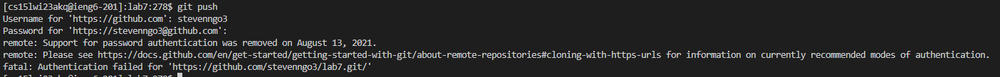

# Lab Report Week 7
## Part 4
Logged into ieng6 by using `ssh cs15lwi23zzz@ieng6.ucsd.edu` + `<enter>` into the terminal. I had my account marked down on a google doc, so I `<ctrl><c>` to copy it and then `<ctrl><v><enter>` to paste the account into the terminal. Typed my password and then `<enter>` into ieng6.

## Part 5
To clone the fork of the repository from my GitHub account, I `<ctrl><c>` to copy the repository link, and did `git clone` with the link pasted in using `<ctrl><v><enter>`.

## Part 6
To run the tests, first I had to change to the lab7 directory so I typed the `ls` + `<enter>` to locate lab7 and then typed `cd lab7` + `<enter>` to get to that directory. I had the JUnit Mac commands on a google doc, so I `<ctrl><c>` the command `javac -cp .:lib/hamcrest-core-1.3.jar:lib/junit-4.13.2.jar *.java`, and `<ctrl><v><enter>` the command to paste it into the terminal. After that, I did the same with the command `java -cp .:lib/hamcrest-core-1.3.jar:lib/junit-4.13.2.jar org.junit.runner.JUnitCore ListExamplesTests`. Tests will fail when you run them.

## Part 7
Now, I had to find and edit the code that caused the failing test. I typed the command `nano ListExamples.java` + `<enter>` to edit the ListExamples file. The failure was coming from the code `index1 += 1` under `while(index2 < list2.size())`, since `index2` was supposed to be incremented, not `index1`. So I did `^W` + typed `while(index2 < list2.size())` + `<enter>`, and did `<down><down><right><right><right><right><right><right><right><right>` to get to `index1` and did `<backspace><2>` to change it to `index2` and `^X` + `<Y>` + `<enter>` to save the file changes.

## Part 8
We can rerun the tests since they should all pass now, so we `<up><up><up>` + `<enter>` to get the command `javac -cp .:lib/hamcrest-core-1.3.jar:lib/junit-4.13.2.jar *.java`, and then did `<up><up><up>` + `<enter>` to get the command `java -cp .:lib/hamcrest-core-1.3.jar:lib/junit-4.13.2.jar org.junit.runner.JUnitCore ListExamplesTests`. This will run the tests, and the tests will now all pass.

## Part 9
Finally, I typed `git add ListExamples.java` + `<enter>` to update the file changes and then typed `git commit -m "Updated"` + `<enter>` to make a new commit. Then I typed `git push` + `<enter>`, typed my username and password. Authentication failed for me, but this is the command to push the changes.

