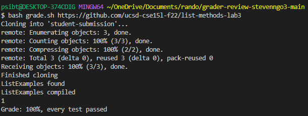
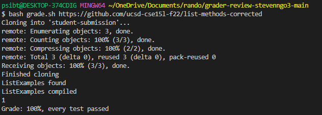
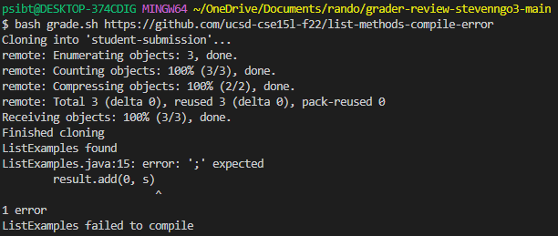
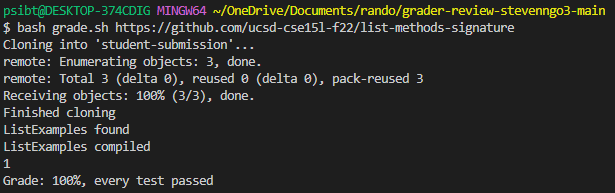
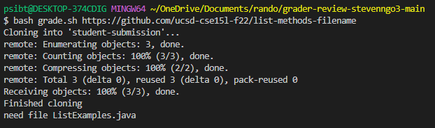
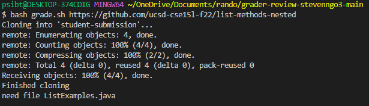
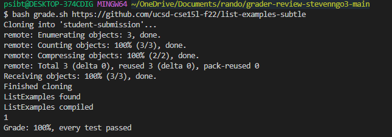

# Lab Report Week 9
## Lab 6 Grading Script
Below is my grading script: 
```CPATH='.;lib/hamcrest-core-1.3.jar;lib/junit-4.13.2.jar'

rm -rf student-submission
git clone $1 student-submission
echo 'Finished cloning'

cd student-submission
if [[ -f ListExamples.java ]]
then echo "ListExamples found"
else echo "need file ListExamples.java"
exit 1
fi

cp ListExamples.java ../
javac -cp ".;../lib/hamcrest-core-1.3.jar;../lib/junit-4.13.2.jar" *.java
if [[ $? == 0 ]]
then echo "ListExamples compiled"
else echo "ListExamples failed to compile"
exit 1
fi

java -cp ".;../lib/junit-4.13.2.jar;../lib/hamcrest-core-1.3.jar" org.junit.runner.JUnitCore TestListExamples > junitresult.txt
JRESULT=`grep -c Failures: junitresult.txt`
echo $JRESULT
if [[ $JRESULT -ne 0 ]]
then echo "Grade: 100%, every test passed"
else echo "Grade: 0%, there is a test failure"
exit 1
fi
```

Repositories that were used to test the grader script (sources from Week 6) and the output from the grader script:

https://github.com/ucsd-cse15l-f22/list-methods-lab3: 



This repository has the same code as the starter from lab 3, and all tests pass as intended, getting a 100%.

https://github.com/ucsd-cse15l-f22/list-methods-corrected:



This repository has the methods corrected and is expected to get full credit. All the tests pass as intended, getting a 100% as well.

https://github.com/ucsd-cse15l-f22/list-methods-compile-error:



This repository has a syntax error of a missing semicolon and with the grader script, it will say that the compiler has failed, as well as state what the error is. Since it failed to compile, no grade is given.

https://github.com/ucsd-cse15l-f22/list-methods-signature: 



This repository has the types for the arguments of filter in the wrong order, so it is supposed to not match the expected behavior. This is one of the only links that failed with my grader script, as every test passed when it wasn't supposed to. I didn't know how to fix the script so that the output would be the intended one, but it looks like my script doesn't have anything that detects when filter is in the wrong order.

https://github.com/ucsd-cse15l-f22/list-methods-filename:



This repository has a great implementation but it is saved in a file with the wrong name. As expected, the output states that the file is needed in order to be graded since the file has the wrong name.

https://github.com/ucsd-cse15l-f22/list-methods-nested:



This repository has a great implementation as well but it is saved in a nested directory called `pa1`. With my grader script, the file isn't detected since it is in a nested directory so it states that a file is needed. I feel like this link would work however if I made some changes that detects nested directories.

https://github.com/ucsd-cse15l-f22/list-examples-subtle:



This repository has more subtle bugs and according to the week 6 write-up, it states `(hints: see assertSame, which compares with == rather than .equals(), and think hard about duplicates for merge)`. The expected output should be that there are failures so it is not a 100% grade, but with my grader script, it states that all tests pass, which shouldn't be the expected output.

Overall, I feel like my grader script works for the most part, but it definitely could be changed so that it detects things such as nested directories.
